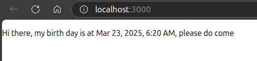
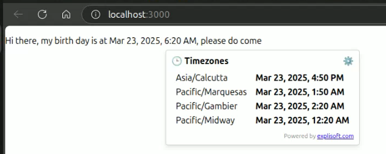
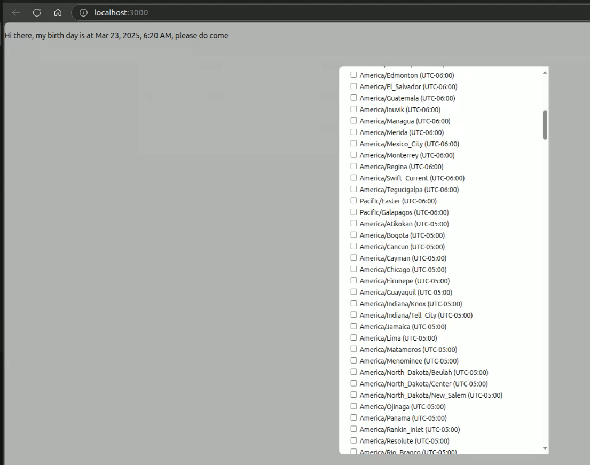

# 🕒 react-multi-timezone-viewer

A smart React component that displays a given datetime in multiple timezones with daylight saving adjustments.  
On hover, it shows a tooltip with selected timezones and an easy-to-use configuration dialog.  
User preferences can be shared across websites using secure storage hosted by [explisoft.com](https://explisoft.com).

---

## ✨ Features

- 🕰 Hover to view time in multiple timezones
- ⚙️ Configurable timezones via gear icon
- 🌐 Cross-site storage support (optional)
- ⏱ Automatically adjusts for Daylight Saving Time (DST)
- 🎨 Custom CSS class support

---

## 📸 Screenshots

### 🔹 Main Component Appearance



### 🔹 Tooltip on Hover



### 🔹 Configuration Dialog



---

## 📦 Installation

```bash
npm install react-multi-timezone-viewer
```

---

## 🚀 Usage

```tsx
import { MultiTimezoneViewer } from 'react-multi-timezone-viewer';

export default function MyComponent() {
  return (
    <div>
      Meeting at{' '}
      <MultiTimezoneViewer
        datetime="2025-03-23 06:20:00"
        dateTimeZone="Asia/Kolkata"
        useCrossSiteStorage={true}
        className="my-time-style"
      />
    </div>
  );
}
```

---

## 🔧 Props

| Prop                  | Type      | Required | Default | Description                                                                 |
|-----------------------|-----------|----------|---------|-----------------------------------------------------------------------------|
| `datetime`            | `string`  | ✅ Yes   | –       | Date & time in `YYYY-MM-DD hh:mm:ss` format                                |
| `dateTimeZone`        | `string`  | ✅ Yes   | –       | Timezone of the given datetime (e.g. `Asia/Kolkata`)                        |
| `useCrossSiteStorage` | `boolean` | ❌ No    | `false` | Enable to share preferences via https://explisoft.com cross-site storage   |
| `className`           | `string`  | ❌ No    | –       | Apply your custom CSS styles to the datetime text                          |

---

## 🧠 How It Works

- Hover over the component to see selected timezone conversions
- Click the ⚙️ gear icon to open a timezone selection dialog
- If `useCrossSiteStorage` is enabled, timezone preferences are saved using an iframe to explisoft.com
- Supports all IANA timezones and DST adjustments automatically

---

## 🎨 Custom Styling

You can pass a `className` to apply your own styles:

```css
.my-time-style {
  color: #3498db;
  font-weight: bold;
  font-family: 'Segoe UI', sans-serif;
}
```

---

## 🛡 Security

This component uses secure cross-origin messaging (`postMessage`) to communicate with `https://explisoft.com`. No personally identifiable information is stored or transmitted.

---

## 📃 License

MIT © 2025 [Nishant Kumar](https://nishant.live)

---

## 🙌 Contributions

Open to pull requests and issues on GitHub. Let's make it better together!

GitHub Repo: [https://github.com/yourgithubprofile/react-multi-timezone-viewer](https://github.com/yourgithubprofile/react-multi-timezone-viewer)
